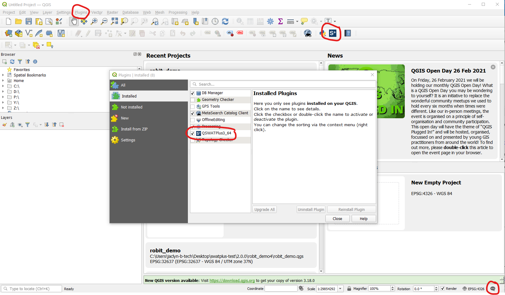
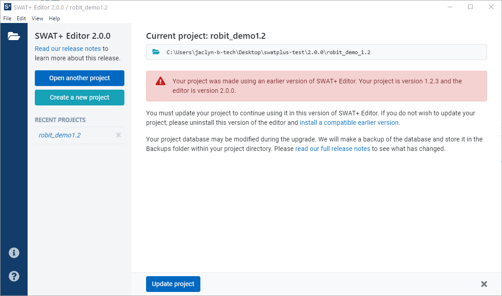

# Installation Troubleshooting

If you are upgrading from a previous version of SWAT+, before installing version 2.0, be sure to close SWAT+ Editor, QSWAT+, and QGIS. If you have trouble opening the software, or loading your existing projects in SWAT+ Editor, open the task manager and verify no instances of `swatplus_rest_api.exe` are running. If they are, right-click and end the task.

We recommend updating QGIS to version 3.16, although version 3.10 is fine as well. Next, [download the SWAT+ Tools installer](../installation.md) and install both QSWAT+ and SWAT+ Editor.

### Loading the QSWAT+ Plugin

For most users, the QSWAT+ plugin should appear automatically in your QGIS toolbar after install. If it does not, click on the Plugins menu, then verify it is listed and checked in your list of installed plugins. If not, check the QGIS messages by clicking the thought bubble icon in the lower right corner of the screen. Click the QSWAT+ tab and copy and paste the messages in a new post in the [QSWAT+ User Group](./). If there is no QSWAT+ tab, check the other tabs for information.

### Updating Version 1.x Projects in SWAT+ Editor

When loading your version 1.x projects in SWAT+ Editor 2.0, the project should open right away and show a screen similar to the following:

If this is what you see, simple click the update project button to continue. While a backup of your project database will be created automatically, it is not a bad idea to keep a backup of your entire project folder manually yourself. Be sure to [read the release notes](../release-notes.md) for a full understanding of what has changed in the model since the last version. Some manual data updates may be necessary.

If you do NOT see the above screen and instead your see a loading spinner for a minute followed by a message that the editor did not load correctly, it's possible that your update didn't work properly. Verify the data of the two files located in your SWATPlus installation folder, `SWATPlus/SWATPlusEditor/resources/app.asar.unpacked/api_dist`.

If either file has a date earlier than February 2021, they did not get updated during installation. Please uninstall SWAT+ entirely, manually delete the SWATPlus folder, and install everything again.

If the date is February 2021 or later, please refer to our generic troubleshooting guide under the unable to load SWAT+ Editor section.



