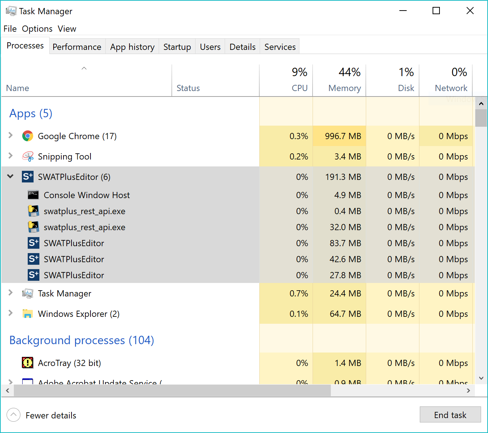

# Troubleshooting

## I received an error setting up my watershed in QSWAT+

Make sure you have [installed](../installation.md) the most recent version of QSWAT+ and followed the [manual's installation instructions](../user/qswat+.md) closely.

If you received an error during steps 1, 2, or 4 of the QSWAT+ interface, please consult the [QSWAT+ user group](https://groups.google.com/d/forum/qswatplus). Check existing questions to see if anyone else had the same problem. If not, please post your error and be as descriptive as possible about what you were doing when you received the error message.

## I received an error in SWAT+ Editor

SWAT+ Editor is most often accessed during step 3 of the QSWAT+ plugin. It may also be launched on its own. Make sure you have [installed](../installation.md) the most recent version of SWAT+ Editor.

If your error is not covered by the solutions below, please consult the [SWAT+ Editor user group](https://groups.google.com/d/forum/swatplus-editor).

### There was an error checking your project configuration

If you receive this message when you first launch your project in the editor, it is a sign the editor did not load its services correctly. While SWAT+ Editor is running, please right-click your Windows taskbar and select Task Manager. Expand the arrow next to SWATPlusEditor and ensure you have swatplus\_rest\_api.exe running as shown in the screenshot below.



If you do not see it running, please open a command prompt window. Make sure you are in the C drive, or the drive where you installed SWAT+. Browse to the location below, then run the swatplus\_rest\_api.exe file.

```text
> cd C:\SWAT\SWATPlus\SWATPlusEditor\resources\app.asar.unpacked\api_dist
> swatplus_rest_api.exe
```

If it is working properly, you should receive something similar to the following:

```text
* Serving Flask app "swatplus_rest_api" (lazy loading)
* Environment: production
WARNING: Do not use the development server in a production environment.
Use a production WSGI server instead.
* Debug mode: off
* Running on http://127.0.0.1:5000/ (Press CTRL+C to quit)
```

If this is what you received, please simply close SWAT+ Editor and try launching it again. If it still doesn't load, or you received an error message above, please contact Jaclyn directly at [jaclynt@tamu.edu](mailto:jaclynt@tamu.edu). You will receive a response as soon as possible, but please understand it may take several days. This error is possibly due to settings on your computer and you may not be able to get a solution from the Google group.

### I received an error importing GIS data or updating my project

Please post the error message to the [SWAT+ Editor user group](https://groups.google.com/d/forum/swatplus-editor) **AND include your project files**. This error is likely project specific and we cannot help you without seeing your project files.

### Other SWAT+ Editor errors

If you receive any other error messages from SWAT+ Editor, from its menu go to View -&gt; Toggle Developer Tools. In the windows that pops open, toggle the Console tab and take a screenshot or copy an errors received and post to the [SWAT+ Editor user group](https://groups.google.com/d/forum/swatplus-editor).

## I received an error running the SWAT+ model

If you received an error running the model, first make sure you have run it in debug mode and checked the detailed error received. If you are not able to make sense of the source of the model error, please post to the [SWAT+ model user group](https://groups.google.com/d/forum/swatplus) **AND include your project files**. This error is likely project specific and we cannot help you without seeing your project files.


