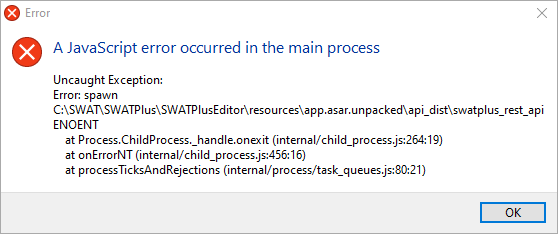

# Troubleshooting

## Bug Fixes / Software Updates

First, check to make sure you have the most recent version of the tools installed. Minor bug fixes may be fixed and updated in the component's source code repository download section.

* [QSWAT+ Installers](https://bitbucket.org/ChrisWGeorge/qswatplus3/downloads/)
* [SWAT+ Editor Installers](https://bitbucket.org/swatplus/swatplus.editor/downloads/)

If you are upgrading from a previous version, before installing an update, be sure to close SWAT+ Editor, QSWAT+, and QGIS. If you have trouble opening the software, or loading your existing projects in SWAT+ Editor, open the task manager and verify no instances of `swatplus_rest_api.exe` are running. If they are, right-click and end the task, and reinstall.

## QSWAT+

### Loading the QSWAT+ plugin

For most users, the QSWAT+ plugin should appear automatically in your QGIS toolbar after install. If it does not, click on the Plugins menu, then verify it is listed and checked in your list of installed plugins. If not, check the QGIS messages by clicking the thought bubble icon in the lower right corner of the screen. Click the QSWAT+ tab and copy and paste the messages in a new post in the [QSWAT+ User Group](./). If there is no QSWAT+ tab, check the other tabs for information.


### I received an error setting up my watershed in QSWAT+

Make sure you have [installed](../installation.md) the most recent version of QSWAT+ and followed the [manual's installation instructions](../user/qswat+.md) closely.

If you received an error during steps 1, 2, or 4 of the QSWAT+ interface, please consult the [QSWAT+ user group](https://groups.google.com/d/forum/qswatplus). Check existing questions to see if anyone else had the same problem. If not, please post your error and be as descriptive as possible about what you were doing when you received the error message.

## SWAT+ Editor

SWAT+ Editor is most often accessed during step 3 of the QSWAT+ plugin. It may also be launched on its own \(search for `SWATPlusEditor`, or find this file in your `SWATPlus/SWATPlusEditor` installation folder\). Make sure you have [installed](../installation.md) the most recent version of SWAT+ Editor.

If your error is not covered by the solutions below, please consult the [SWAT+ Editor user group](https://groups.google.com/d/forum/swatplus-editor).

### Blank screen or error upon opening

If you receive an error message similar to the image below, or you see a loading spinner for a minute followed by a message that the editor did not load correctly, it's possible that your installation didn't work properly. 



Verify the files located in your SWATPlus installation folder, `SWATPlus/SWATPlusEditor/resources/app.asar.unpacked`. The contents should be as described below:

* `api_dist`
  * `swatplus_api.exe`
  * `swatplus_rest_api.exe`
* `swat_exe`
  * _There should be several executable files matching the current model revision number, e.g.,_ `rev60.5.2_64rel.exe`
* `appsettings.json`
* `swatplus_vardefs.sqlite`

If any or all of the files above are missing, your installation did not complete successfully. You might try disabling your antivirus and installing again. Otherwise, download the zip file [linked here](https://bitbucket.org/swatplus/swatplus.editor/downloads/troubleshooting-resources-dir-win-2.0.3.zip) and replace the resources folder entirely. Extract the zip to `SWATPlus/SWATPlusEditor`. Note: this is Windows only.

### Unable to get project information from database

If you receive this message when you first launch your project in the editor, it is a sign the editor did not load its services correctly. 

Click the question mark icon in the lower left corner to open the help page. Scroll to the bottom and looking for the "Troubleshooting" section. If you see a message stating "Unable to connect to SWAT+ API", please try the following steps before contacting support:

Open a command prompt window. Make sure you are in the drive where you installed SWAT+. Browse to the location below, then run the swatplus\_rest\_api.exe file.

```text
> cd C:\SWAT\SWATPlus\SWATPlusEditor\resources\app.asar.unpacked\api_dist
> swatplus_rest_api.exe
```

If it is working properly, you should receive something similar to the following:

```text
* Serving Flask app "swatplus_rest_api" (lazy loading)
* Environment: production
WARNING: Do not use the development server in a production environment.
Use a production WSGI server instead.
* Debug mode: off
* Running on http://127.0.0.1:5000/ (Press CTRL+C to quit)
```

If this is what you received, please simply close SWAT+ Editor and try launching it again. 

If you get no message on the screen at all, it might be a permission error or problem related to your computer settings. Try installing to another location on your machine, such as another hard drive, or even install to a flash drive. If this still does not work, try another machine.

If you still cannot get it to open, you may need to try the Python version of the editor. You will need to install [Python version 3.x](https://www.python.org/) on your machine first. Make note of your Python PATH variable \(typically `python` on Windows or `python3` on Linux/MacOS\). [Contact the developer](mailto:eco.web@tamu.edu) for a custom Python installer of the editor.

After install, go to where you installed the editor and open the `appsettings.json` file located in the `resources/app.asar.unpacked` directory. Set your python PATH variable in the appropriate section of the file.

### Problems updating a project from version 1.x

When loading your version 1.x projects in SWAT+ Editor 2.0, the project should open right away and show a screen similar to the following:


If this is what you see, simple click the update project button to continue. While a backup of your project database will be created automatically, it is not a bad idea to keep a backup of your entire project folder manually yourself. Be sure to [read the release notes](../release-notes.md) for a full understanding of what has changed in the model since the last version. Some manual data updates may be necessary.

If you do NOT see the above screen and instead your see a loading spinner for a minute followed by a message that the editor did not load correctly, it's possible that your update didn't work properly. Verify the date of the two files located in your SWAT+ installation folder, `SWATPlus/SWATPlusEditor/resources/app.asar.unpacked/api_dist`.

If either file has a date earlier than the release date of the editor, they did not get updated during installation. Please uninstall SWAT+ entirely, manually delete the `SWATPlus` folder, and install everything again.

### Other SWAT+ Editor errors

If you receive any other error messages from SWAT+ Editor, from its menu go to View -&gt; Toggle Developer Tools. In the windows that pops open, toggle the Console tab and take a screenshot or copy an errors received and post to the [SWAT+ Editor user group](https://groups.google.com/d/forum/swatplus-editor).

## SWAT+ Model

If you received an error running the model, first make sure you have run it in debug mode and checked the detailed error received. If you are not able to make sense of the source of the model error, please post to the [SWAT+ model user group](https://groups.google.com/d/forum/swatplus) **AND include your project files**. This error is likely project specific and we cannot help you without seeing your project files.

