# Getting Started

## What you'll need


Make sure you have downloaded and installed QSWAT+, SWAT+ wgn and soils databases, and SWAT+ Editor as described in the installation section linked below.




The following guide will show you how to get started with SWAT+ Editor. This guide does not cover how to set up your watershed in QSWAT+. Please refer to the [QSWAT+ manual](user/qswat+.md) for this step.

## Demo project files

Please use the following Robit demo project, which has already been set up in QSWAT+. Alternatively, you may use the Robit project you set up on your own after following the steps in the [QSWAT+ manual](user/qswat+.md).



## Watch the SWAT+ Editor guide video

Please [watch the guide video](https://youtu.be/iZHt22-5OFk) before launching SWAT+ Editor. This video will quickly walk you through the steps needed to bring your QSWAT+ project into the editor, as well as show you how to catch and report errors. If you prefer a written guide instead of or in addition to the video, a walk through is shown below.

## Walk through guide for SWAT+ Editor

If you do not want to watch a video, follow the steps below. This guide shows the basic steps you need to take to set up your model, but does not cover all input parameters available through the editor. Please refer to the SWAT+ Editor documentation section for help editing specific input parameters.



### Set up your project in QSWAT+

Follow the [QSWAT+ manual](user/qswat+.md) to set up your watershed. To open SWAT+ Editor from within QSWAT+, click the button for Step 3: Edit Inputs and Run SWAT.

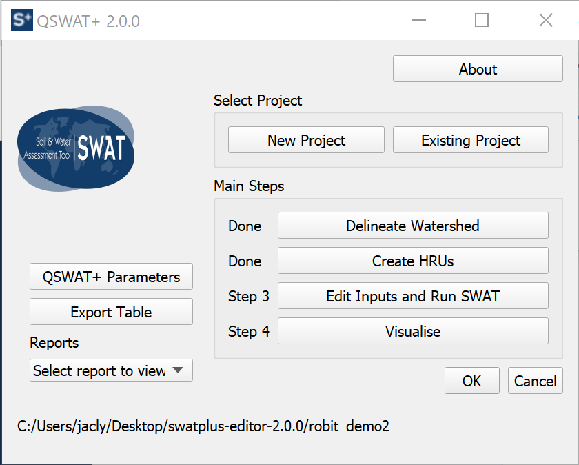

### Open your project in the editor

The first time your open your QSWAT+ project in SWAT+ Editor, your data must be imported from the GIS tables into SWAT+ database format. This may take a few seconds to several minutes depending on the size of your watershed.

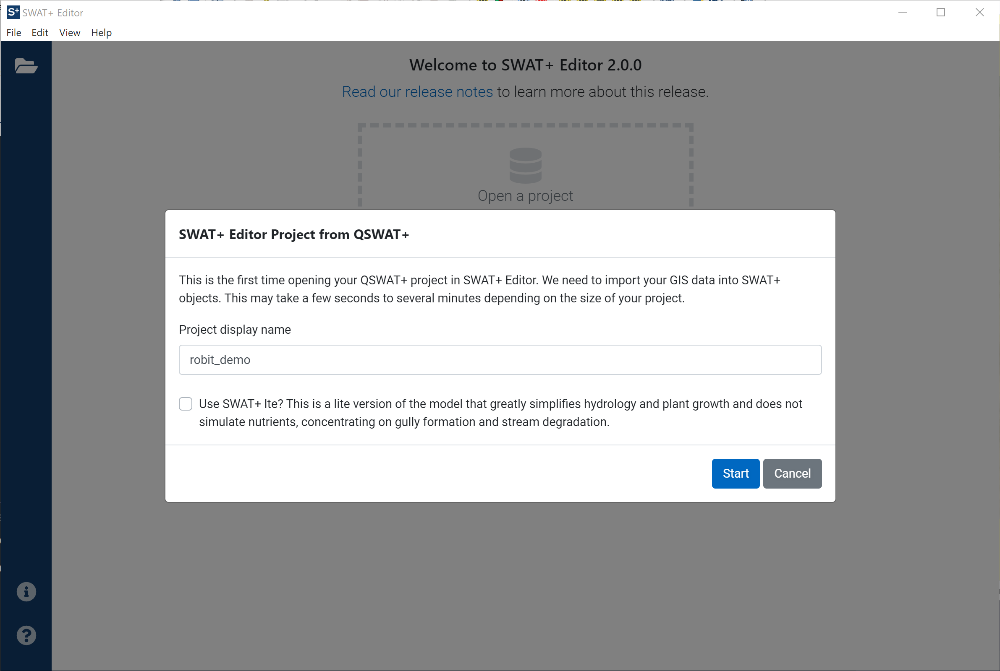

When your GIS data is done loading, your project will be displayed in the center. Click the get started button at the bottom to begin editing your inputs.

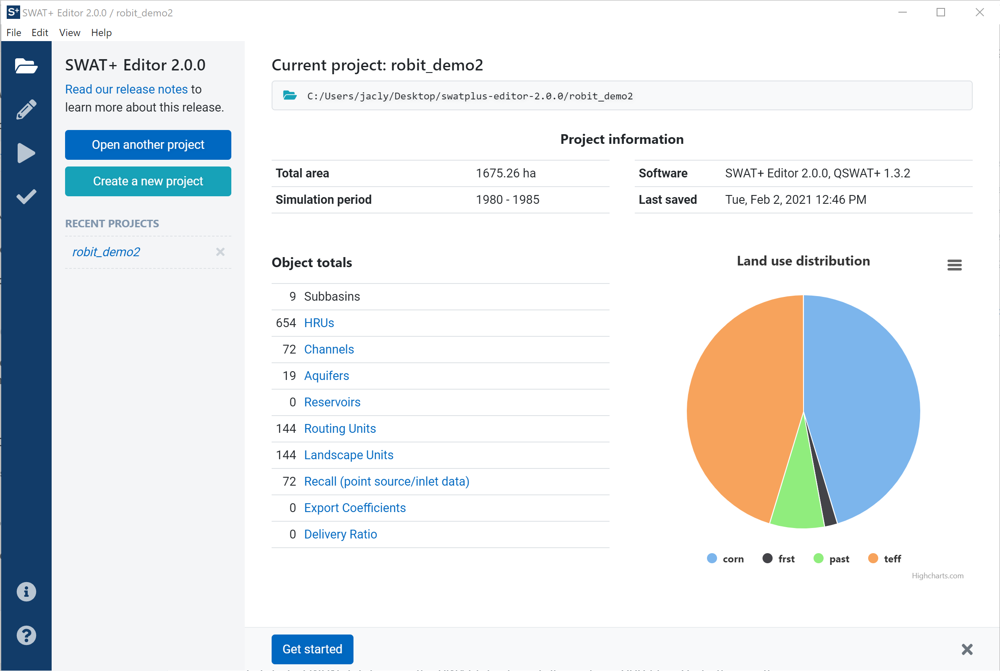

### Edit SWAT+ inputs

The first step you should take is to add weather generator \(WGN\) data. It may be imported from the distributed WGN database in the SWAT+ Tools installer, or from CSV files. Go to the weather generator section and click the import data button as shown in the screenshot below.

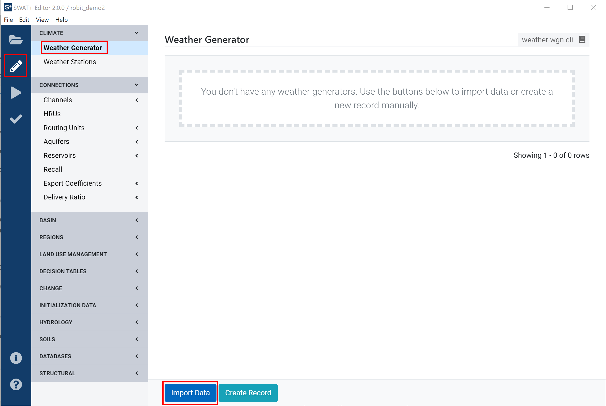

The database import option is selected by default, with the global CSFR weather generator table chosen. Click in the box to see other table options. `wgn_us` is weather generator data for the United States. `wgn` is an empty table you may populate with your own data if desired.

Alternatively, select CSV files from the top pull-down menu. In the Robit demo dataset, we have provided CSV files to use for weather generators, located in the Wgn folder of the sample project linked at the top of this page. Select these files in the editor as shown in the screenshot below, check the box to use observed weather data, then click the start import button.

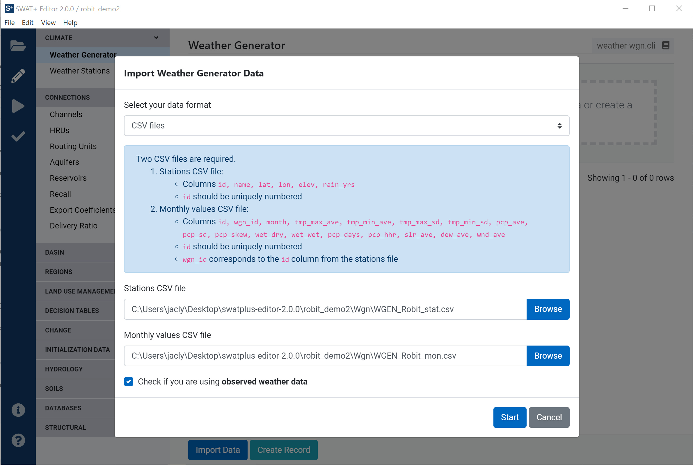

You should now see one weather generator station added. Next, we need to add observed weather data. From the left menu in the editor, click the Weather Stations link.

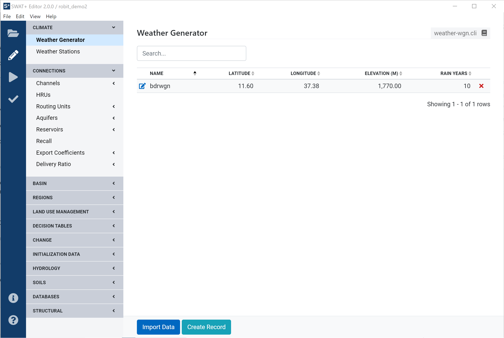

Click the import data button to import your files. In the Robit demo dataset, we have provided weather data in SWAT2012 format in the Weather directory. Select this folder as the SWAT2012 weather files directory in the editor's import form. You may also choose where to save the files when they are converted to SWAT+ format. By default, your TxtInOut folder is selected. Click the start button to continue.

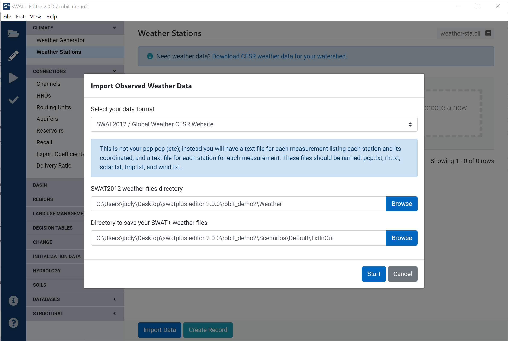

You should now see one weather station added. You can click on the name of the files to open them directly from the editor. You'll see this station is automatically connected to the weather generator created in the last step. This weather station is also connected to all of your spatial connection objects during import. In projects where you have more than one station, it is automatically assigned by closest latitude/longitude.

This concludes the last required section for editing SWAT+ inputs before writing files and running the model. The remaining sections are not covered in this walk-through, however you can look through the [SWAT+ Editor Documentation](user/editor/) section for more information.

In this demo, we'll go ahead and proceed to the next step. From the navy ribbon on the left side of the editor, click on the play/triangle icon. 

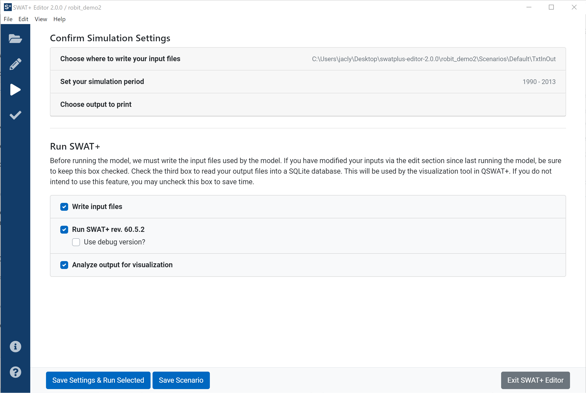

You will see three sections up top to adjust your simulation settings if desired. Your input files will be saved to `[Project Directory]/Scenarios/Default/TxtInOut` by default. Click on "Set your simulation period" to adjust your starting and ending simulation dates.

When you click on a date picker, please note that you may use the arrows at the top of the date picker to move between decades and years. For this demo, set the ending simulation date to December 31, 2000. Use the arrows to find the year 2000, then click on the 31 in December to confirm the new date.

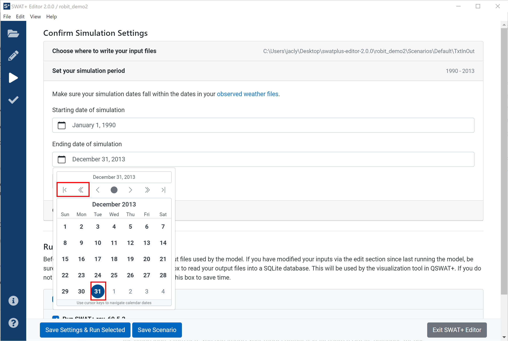

Click on the next section: choose output to print. Adjust your warm-up period to 3 years. Scroll to see all the available outputs to print. Use the top row of check boxes to select all yearly and average annual outputs.

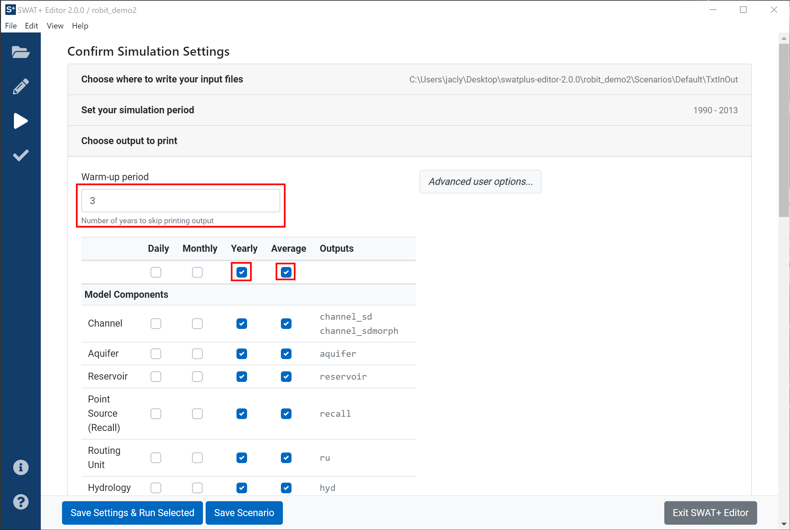

Scroll down, or click on "choose output to print" again to collapse the section. Now you will see three checkboxes of tasks: write inputs, run the model, and analyze output.

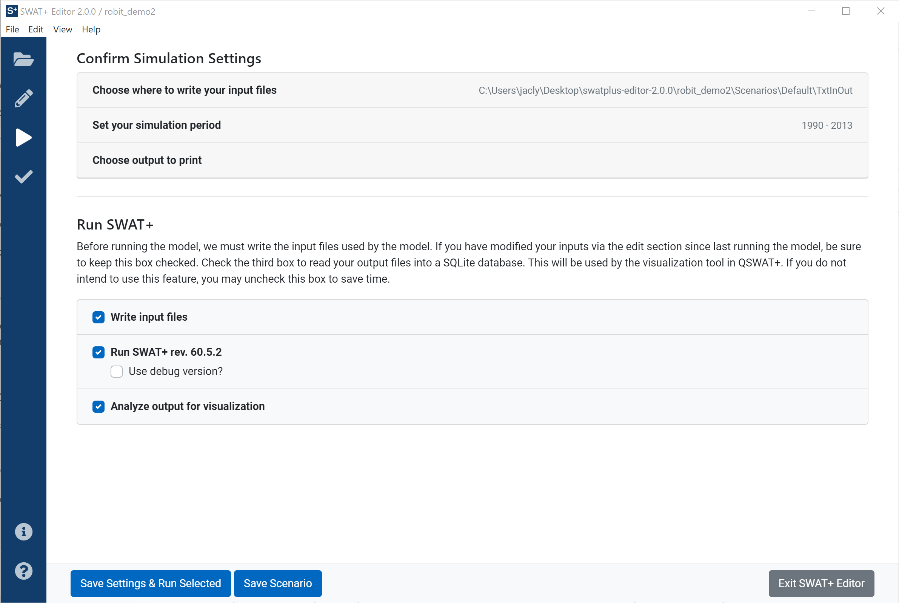

Here is a brief description of each task:

1. **Write input files** Translate your data saved from the edit inputs section in your project SQLite database to text files read by SWAT+. Any time you make edits, be sure to keep this box checked to re-write your files.
2. **Run SWAT+** Execute a compiled version of the model.
3. **Analyze output for visualization** Read the output text files generated by the model into a SQLite database used for SWAT+ check and the QSWAT+ visualization tool

For this demo, and because it is our first time running the simulation, keep all three boxes checked. Click the "Save Settings & Run Selected" button to continue. When the tasks complete, you'll be presented with a menu of options for what to do next.

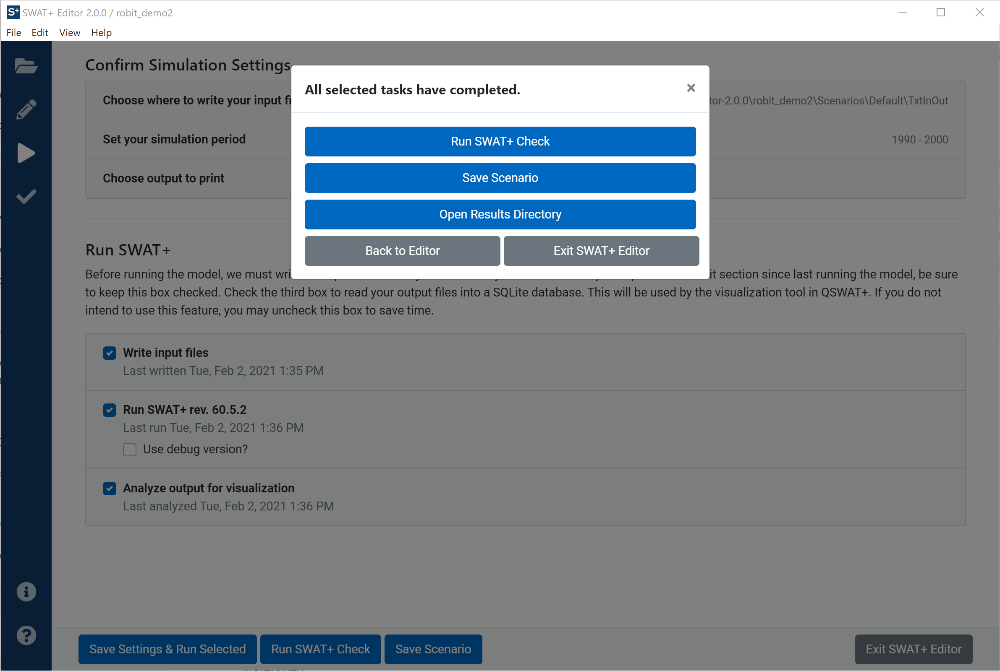

You may click to run SWAT+ Check to check for potential model problems. You may also save your scenario, which will make a copy of all of your inputs and outputs. After saving completes, any additional changes made to your project will not affect the saved scenario. You may load the saved scenario back to the editor from the project setup screen.

This concludes the introductory walk-through of SWAT+ Editor. You may close the editor by clicking the "Exit SWAT+ Editor" button from the interface, or by clicking the X in the top right of the editor window, or by going to File-&gt;Exit from the editor's menu.

After exiting the editor, you may proceed to QSWAT+ step 4: visualization. Please refer to the [QSWAT+ manual](user/qswat+.md) for more information about this process.

