# Getting Started

## What you'll need


 Make sure you have downloaded and installed QSWAT+, SWAT+ wgn and soils databases, and SWAT+ Editor as described in the installation section linked below.




The following guide will show you how to get started with SWAT+ Editor. This guide does not cover how to set up your watershed in QSWAT+. Please refer to the [QSWAT+ manual](user/qswat+.md) for this step.

## Demo project files

Please use the following Robit demo project, which has already been set up in QSWAT+. Alternatively, you may use the Robit project you set up on your own after following the steps in the [QSWAT+ manual](user/qswat+.md).



## Watch the SWAT+ Editor guide video

Please [watch the guide video](https://youtu.be/OmqKO0Gm5co) before launching SWAT+ Editor. This video will quickly walk you through the steps needed to bring your QSWAT+ project into the editor, as well as show you how to catch and report errors. If you prefer a written guide instead of or in addition to the video, a walk through is shown below.

## Walk through guide for SWAT+ Editor

If you do not want to watch a video, follow the steps below. This guide shows the basic steps you need to take to set up your model, but does not cover all input parameters available through the editor. Please refer to the SWAT+ Editor documentation section for help editing specific input parameters.



### Set up your project in QSWAT+

Follow the [QSWAT+ manual](user/qswat+.md) to set up your watershed. To open SWAT+ Editor from within QSWAT+, click the button for Step 3: Edit Inputs and Run SWAT.

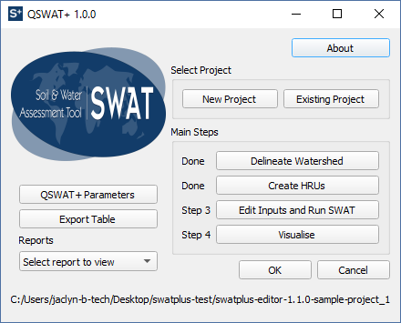

### Open your project in the editor

The first time your open your QSWAT+ project in SWAT+ Editor, your data must be imported from the GIS tables into SWAT+ database format. This may take a few seconds to several minutes depending on the size of your watershed.

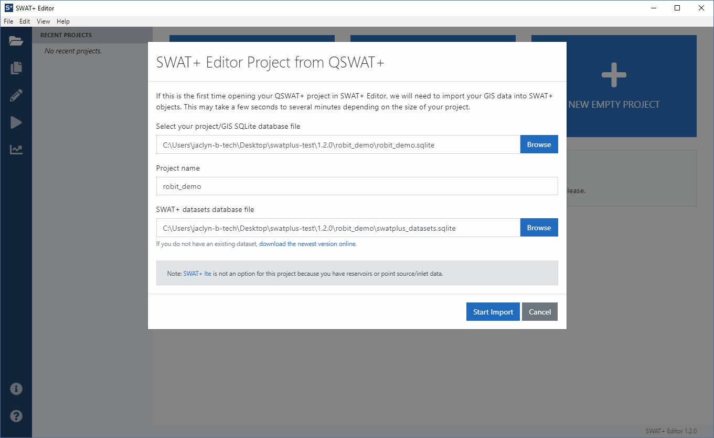

When your GIS data is done loading, your project will be displayed in the light blue box in the top center of the editor. Click the start editing SWAT+ inputs button to begin.

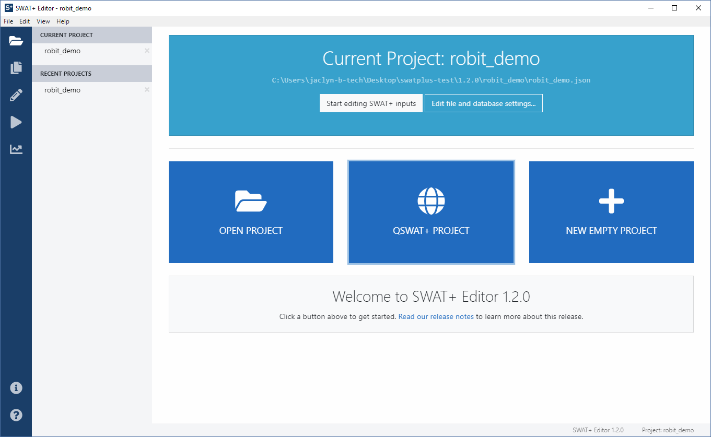

### Edit SWAT+ inputs

The first step you should take is to add weather generator \(WGN\) data. It may be imported from the distributed WGN database in the SWAT+ Tools installer, or from CSV files. Go to the weather generator section and click the import data button as shown in the screenshot below.

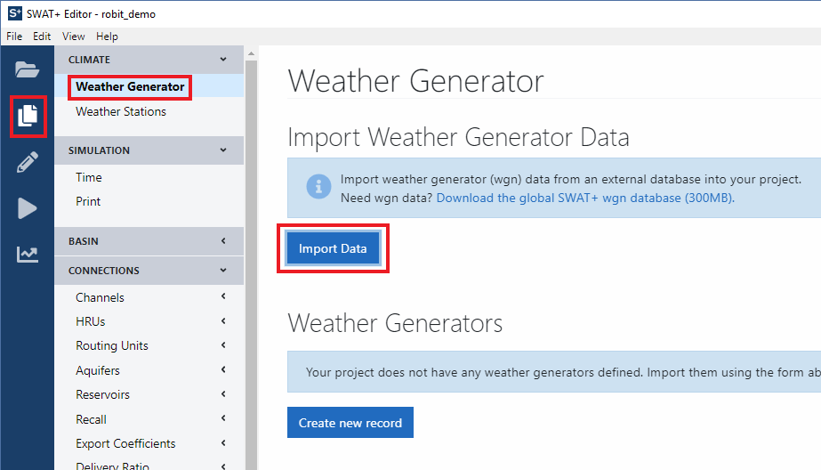

The database import option is selected by default, with the global CSFR weather generator table chosen. Click in the box to see other table options. `wgn_us` is weather generator data for the United States. `wgn` is an empty table you may populate with your own data if desired.

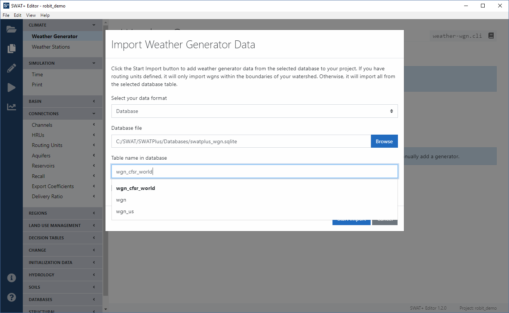

Alternatively, select CSV files from the top pull-down menu. In the Robit demo dataset, we have provided CSV files to use for weather generators, located in the Wgn folder of the sample project linked at the top of this page. Select these files in the editor as shown in the screenshot below, then click the start import button.

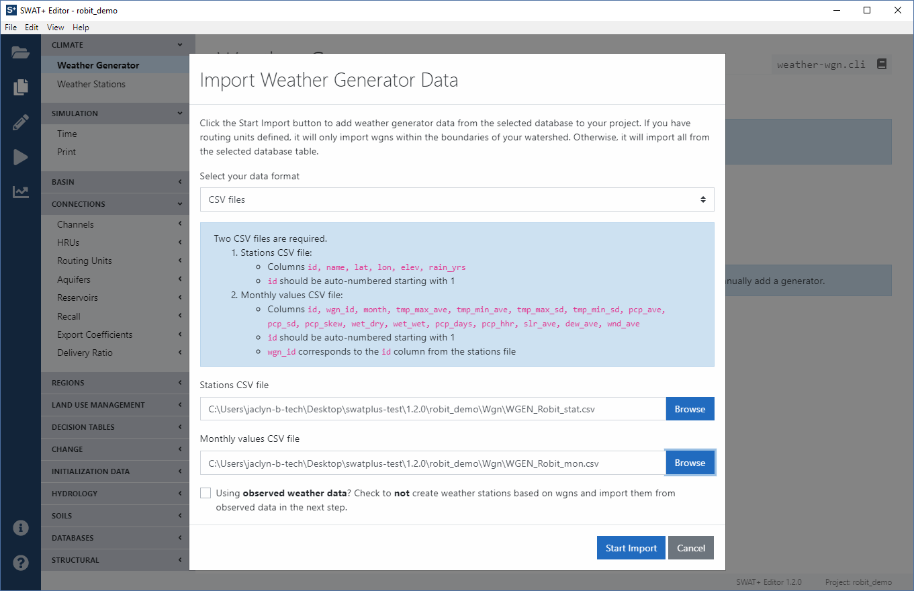

You should now see one weather generator station added. Next, we need to add observed weather data. From the left menu in the editor, click the Weather Stations link.

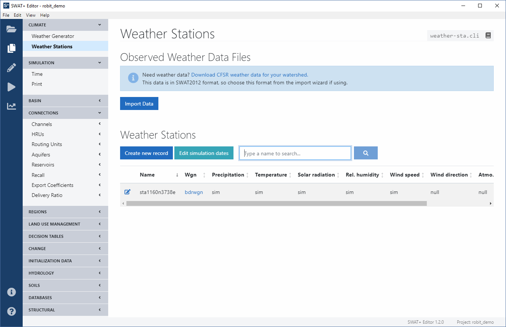

Click the import data button to import your files. In the Robit demo dataset, we have provided weather data in SWAT2012 format in the Weather directory. Select this folder as the SWAT2012 weather files directory in the editor's import form. You may also choose where to save the files when they are converted to SWAT+ format. By default, your TxtInOut folder is selected. Click the start import button to continue.

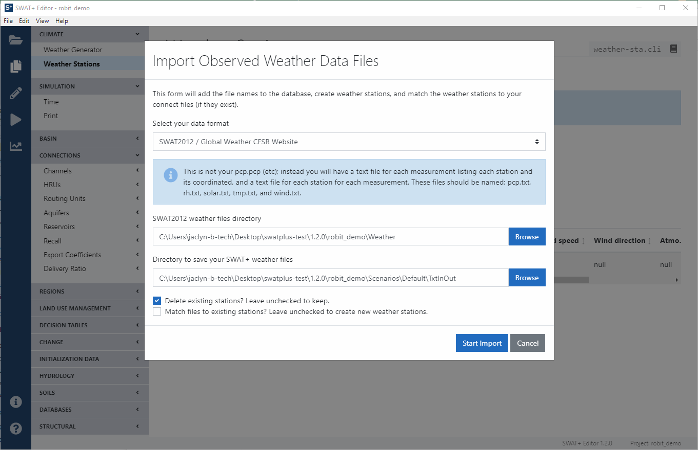

Once your data has been converted to SWAT+ format and imported to your project, we've also automatically adjusted your simulation dates. From the left menu in the editor, under the Simulation heading, click on Time. You may alter your simulation starting and ending times, however make sure they fall within the range of your observed weather data. If you have made any changes, click the save changes button.

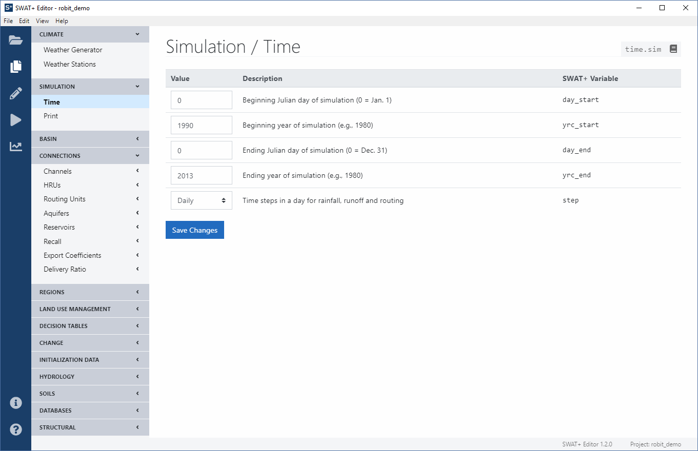

Next, select what data you want to print from your simulation. We advise not printing all daily output files as the file size can be very large and take a long time to import to the database for visualization. For the Robit demo, please change the number of skip years to 3, then check the boxes to print all monthly and annual output. Click the save changes button when done.

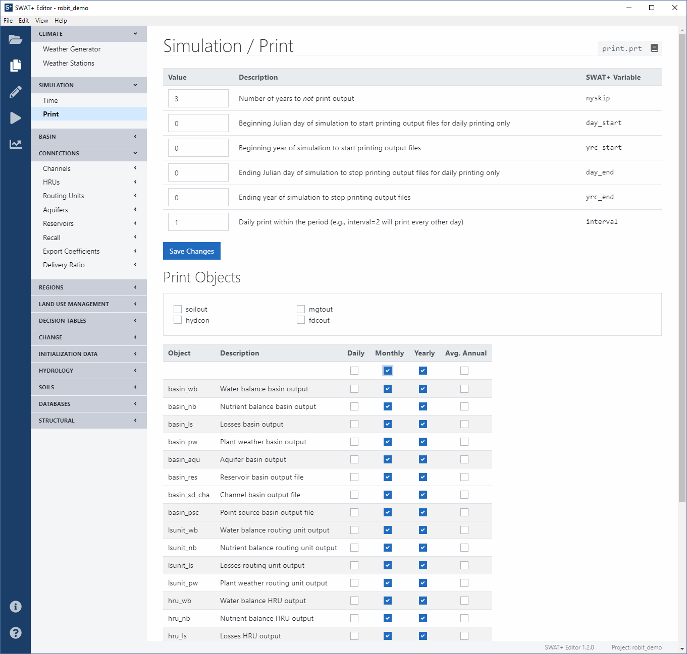

This concludes the last required section for editing SWAT+ inputs before writing files and running the model. The remaining sections are not covered in this walk-through, however you can look through the [SWAT+ Editor Documentation](user/editor/) section for more information.

In this demo, we'll go ahead and proceed to the next step: writing SWAT+ input files. From the navy ribbon on the left side of the editor, click on the pencil icon. Choose your location to write the files, then click the save and write files button.

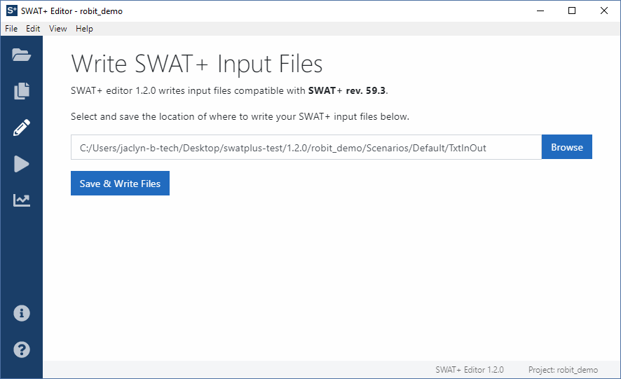

When done, from the navy ribbon on the left side of the editor click the next step with the triangle/play icon to run the model. By default, the release version of the model is run. If you encounter an error, you can come back and check the box to run in debug mode to get a detailed error message from the model.

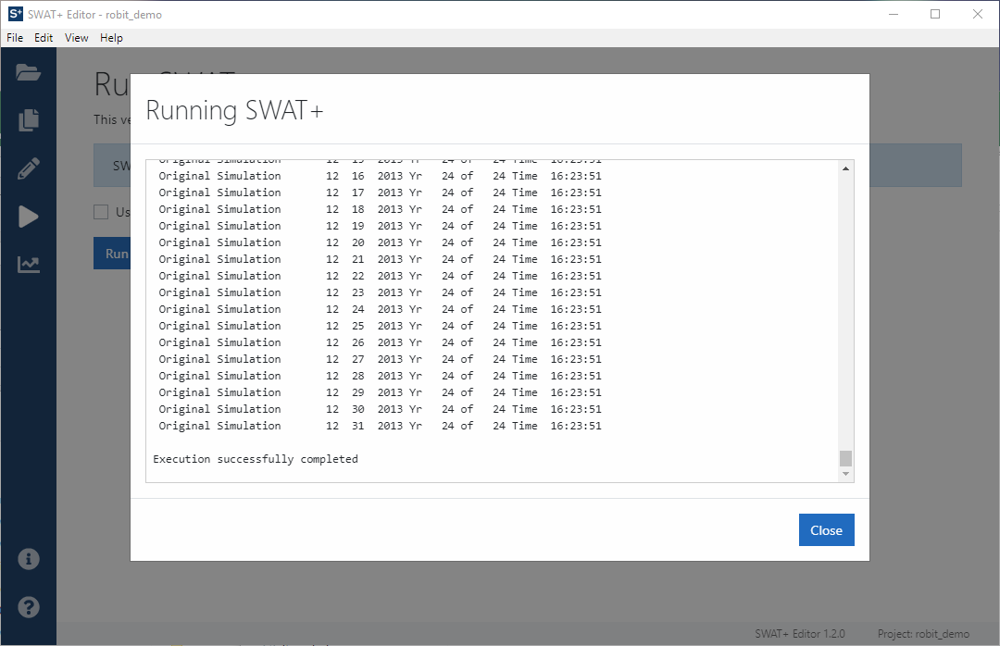

After the model run has finished successfully, from the navy ribbon on the left side of the editor, click the graph icon. From here you can import your model output text files into a SQLite database for use with the QSWAT+ visualization tool. Output may take a long time to import depending on the length of your simulation, the output files selected from the Simulation-&gt;Print section, and the size of your watershed.

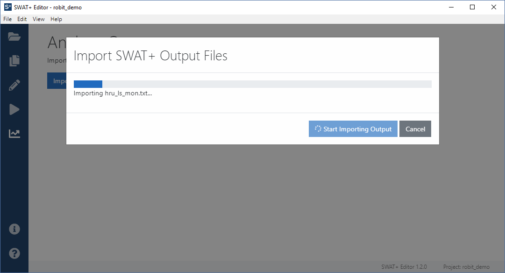

When the editor finishes importing your output, you may close the editor by clicking the X in the top right of the editor window, or by going to File-&gt;Exit from the editor's menu.

You may now proceed to QSWAT+ step 4: visualization. Please refer to the [QSWAT+ manual](user/qswat+.md) for more information about this process.

