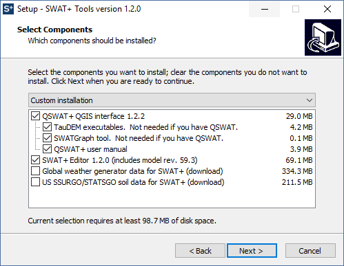

# Installation

## 1. Install QGIS 3

If you plan to use QSWAT+ to set up your watershed, please install QGIS 3 before installing SWAT+. It can be downloaded from the [QGIS download page](https://www.qgis.org/en/site/forusers/download.html), where you should select the **Long term release repository**, and the **64 bit standalone installer**. Use the default folder C:\Program Files\QGIS 3.4 as the installation folder. See the [QSWAT+ manual](user/qswat+.md) for further instructions.

**Please note you must use QGIS version 3, not version 2.**

## 2. SWAT+ Tools Installer

To install the SWAT+ model and interface components, please use the installer linked below. The installer is for 64-bit Windows machines. Administrator privileges are not required, however you must have access to your C drive.


### [**Download SWAT+ Installer 1.2**.0](https://plus.swat.tamu.edu/downloads/swatplustools-installer-1.2.0.zip)

Windows 64 bit  
Includes SWAT+ rev. 59.3, QSWAT+ 1.2.2, SWAT+ Editor 1.2.0, and SWAT+ databases  
[Release notes](release-notes.md)


Upon opening the installer, you will be presented with a screen asking which components you would like to install. The soils and weather generator databases will be downloaded in the next screen if checked.

If QSWAT+ and SWAT+ Editor are selected, their individual installers will open next.  

## SWAT+ Model \(Command Line Executable\)

The model itself is packaged with SWAT+ Editor and we recommend using the editor to modify your inputs and run the model. However, if you would like to download just the command line executable file, it is available below.

### Windows 64 bit



### Linux 64 bit






Note: the QSWAT+ and SWAT+ Editor available above require a Windows machine. However, we plan to compile for Linux at a later time. Please contact us if you need this.


## SWAT+ SQLite Datasets

We recommend using the SWAT+ Tools installer above for installing the SWAT+ datasets databases to their proper locations. However, if you need to access these components individually, they are linked below:

* [SWAT+ datasets](https://bitbucket.org/swatplus/swatplus.editor/downloads/swatplus_datasets.sqlite)
* [SWAT+ global weather generator data](https://bitbucket.org/swatplus/swatplus.editor/downloads/swatplus_wgn.sqlite)
* [SWAT+ US SSURGO/STATSGO soil data](https://bitbucket.org/swatplus/swatplus.editor/downloads/swatplus_soils.sqlite)

These files should be placed in `C:\SWAT\SWATPlus\Databases`

