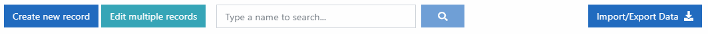
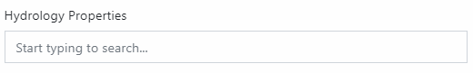

# Edit SWAT+ Inputs

Click the paper icon in the leftmost blue toolbar to enter the editing section. Most editors in this section are a literal representation of the SWAT+ input files. The collapsible dark-gray headings on the left correspond to the section lines in the master watershed file \(file.cio\).

When you click on an editor section from the left menu, you'll find the default SWAT+ file name with which the section corresponds. This enables you to quickly look up further information in the SWAT+ input/output documentation.

## Navigating the Editor

Most data is presented in a tabular format. When you click a row, you're presented with a form where you can make changes and save. The following features are common across many editor sections.

### Action Bar

At the top of most tables, you'll see the following action bar. Not all sections will have each option available.

Click create new record to add an item to the table. Edit multiple records allows you to set a single value for one or more fields across all or selected rows in your table.

In the search box, start typing the name of the object you want to view. Matching options will appear below the text box. Click the one you want, then click the search icon button to the right.

The import/export data button allows you to quickly access your data in CSV \(comma-separated values spreadsheet\) format, in most cases. We recommend exporting your data \(or empty table is okay\) first to get a template with the column names. You may then modify the file and import it back into the editor.

### Tables

Sort by a column in the table by clicking on the heading name. It will toggle ascending or descending direction as indicated by the arrows next to the name.

Tables with many records can be scrolled and then paged by clicking the page number or arrow links at the bottom of the table.

Each row may contain an edit/view icon on the far left to access the data in the row, and a delete icon on the far right \(may need to scroll to access the far right of the table\). We do not recommend deleting rows unless you are absolutely sure they are not used elsewhere in your model. Due to the relationships of data in SWAT+, deleting records could have unintended effects and break your model. Deleting cannot be undone; if in doubt, make a backup of your project SQLite database first.

### Forms

Most objects in SWAT+ have a name field and are identified using this name. Names should be unique and not contain spaces \(spaces will be automatically converted to underscores\).

Each form will have a save changes button toward the bottom. Be sure to click this button after making any changes and before leaving the form.

#### Look-up Fields

There are a lot of relationships between objects in SWAT+. For example, all fields in your channel properties table link to rows in other tables. In SWAT+ Editor forms, you can easily select these related rows by starting to type an object's name and select it as it pops up. If you accidentally enter an incorrect name, the editor will return an error stating the record does not exist in your database.


**Tip:** due to all of these relationships, it may be necessary to add data in a seemingly backwards manner. For example, you will need to add channel hydrology data before adding a row in channel properties, and channel properties will need to be added before a channel connection object. In most cases, these connection objects are imported from GIS so it is not an issue, but it is good to be aware.


## Getting Started

We recommend starting in the climate section, and importing your weather generators and observed weather data. If you're coming from GIS, when you import weather generators or observed data, it will create weather stations and match them to your spatial objects automatically.

