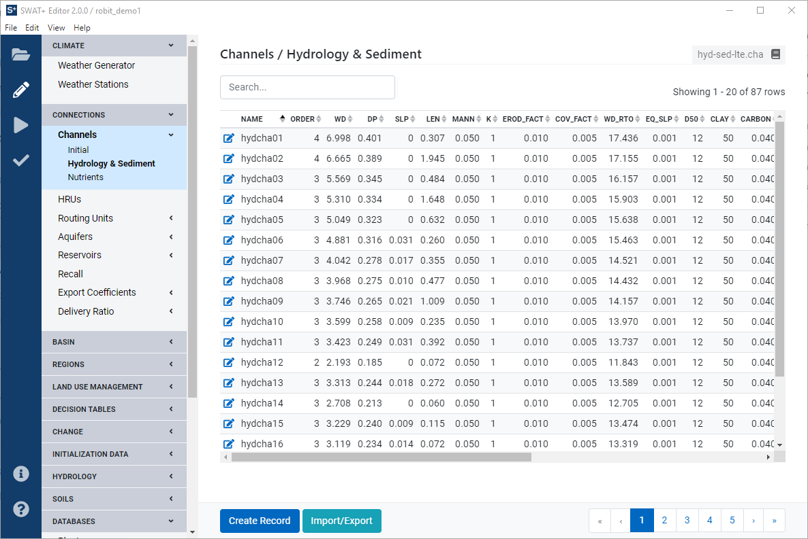
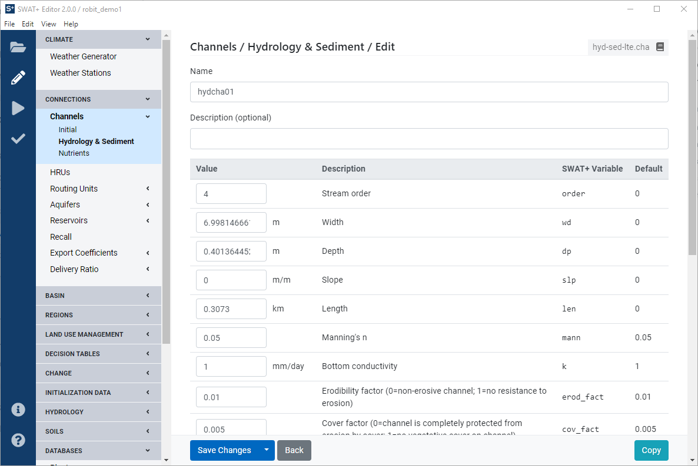
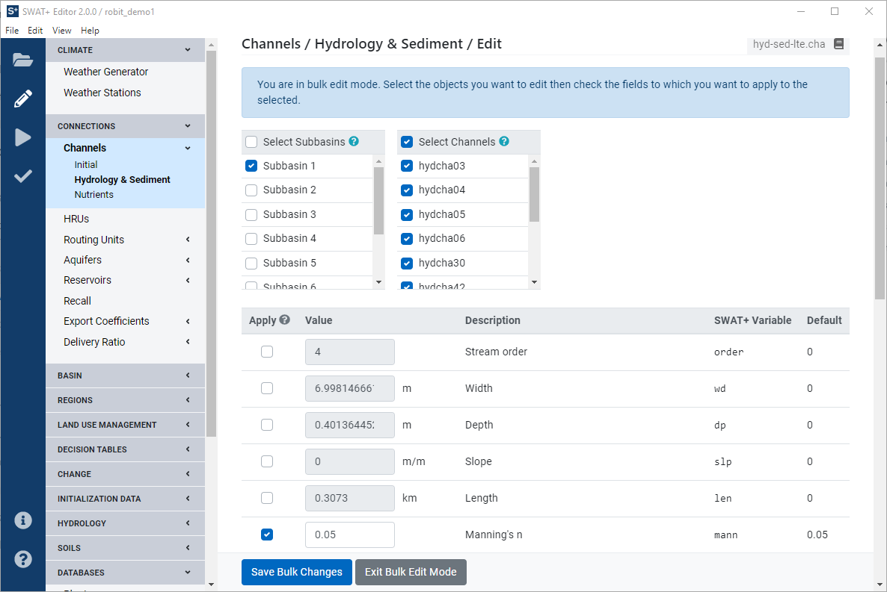

# Edit SWAT+ Inputs

Click the pencil icon in the leftmost blue toolbar to enter the editing section. Most editors in this section are a literal representation of the SWAT+ input files. The collapsible dark-gray headings on the left correspond to the section lines in the master watershed file \(file.cio\).

When you click on an editor section from the left menu, you'll find the default SWAT+ file name with which the section corresponds. This enables you to quickly look up further information in the SWAT+ input/output documentation.

## Navigating the Editor

Most data is presented in a tabular format. When you click a row, you're presented with a form where you can make changes and save. The following features are common across many editor sections.

### Tables

Sort by a column in the table by clicking on the heading name. It will toggle ascending or descending direction as indicated by the arrows next to the name.

Tables with many records can be scrolled and then paged by clicking the page number or arrow links at the bottom of the table.

Each row may contain an edit/view icon on the far left to access the data in the row, and a delete icon on the far right \(may need to scroll to access the far right of the table\). We do not recommend deleting rows unless you are absolutely sure they are not used elsewhere in your model. Due to the relationships of data in SWAT+, deleting records could have unintended effects and break your model. Deleting cannot be undone; if in doubt, make a backup of your project SQLite database first.

In the search box up top, start typing the name of the objects you want to find. Matching options will appear in the table. Remove the text from the search box to remove the filter.

In the action bar at the bottom, click create new record to add an item to the table. The import/export data button allows you to quickly access your data in CSV \(comma-separated values spreadsheet\) format, in most cases. We recommend exporting your data \(or empty table is okay\) first to get a template with the column names. You may then modify the file and import it back into the editor.

### Editing Form

Most objects in SWAT+ have a name field and are identified using this name. Names should be unique and not contain spaces \(spaces will be automatically converted to underscores\).

Each edit form will have a save changes button at the bottom. Be sure to click this button after making any changes and before leaving the form.

Press the back button to return to the previous screen. Click copy to make a copy of the current object you are viewing. You will be asked to give the copied object a unique name. Note: the copy function is not available for all object types, including connection objects.

#### Look-up Fields

There are a lot of relationships between objects in SWAT+. For example, all fields in your channel properties table link to rows in other tables. In SWAT+ Editor forms, you can easily select these related rows by starting to type an object's name and select it as it pops up. If you accidentally enter an incorrect name, the editor will return an error stating the record does not exist in your database.

#### Bulk Editing

If you want to apply changes to a field for multiple objects at once, you can use bulk edit mode. Select one object from the table as your base. This can be useful if you want to use its values to apply across many other objects, but if you're using entirely new values, it does not matter which object you select.

From the object's edit form page, click the arrow on the right side of the save changes button and then click "Make changes to multiple records..." to enter bulk edit mode.

First, select the objects to which you want to make changes. Note that the object you're currently viewing is not selected by default. For most sections, you can filter your selection by subbasin first. If you're editing an HRU-level objects, you can also filter by landuse. In the above example, we checked Subbasin 1, which then populated the next list with channels that fall into Subbasin 1. All are selected by default, but you can uncheck as needed.

Next, choose which fields you want to edit by clicking the check box to the left of the field. In the above example, we checked the box for Manning's n. Enter the value you want and click Save Bulk Changes. Manning's n will be updated to your new value for each selected channel.

## Getting Started with Your Data

We recommend starting in the climate section, and importing your weather generators and observed weather data. If you're coming from GIS, when you import weather generators or observed data, it will create weather stations and match them to your spatial objects automatically.

