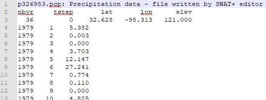

# Climate

## Weather Stations

Weather stations are linked from all of your connection objects \(channels, HRUs, etc.\) in SWAT+. If you are coming from QSWAT+, it is much better to import stations either from the weather generator section, or the observed weather file importer than it is to create them manually.

By importing through one of the methods described below, your new stations will be automatically matched your spatial connection objects.

## Import Weather Generator Data

Click the import data button to import weather generator \(wgn\) data for your project. If you installed the SWAT+ databases, this file will be selected by default along with the CFSR world table. USA wgn data is also available from this database; type wgn\_us to use this table.

You may also add your own data to this database using the wgn and corresponding wgn\_mon tables.



Below the table name field is a check box asking if you are using observed weather data. By default \(unchecked\), when you click start import, weather stations will be created based on your wgn locations. If you are using observed weather data and prefer to have weather stations created based on this data, check this box--stations will not be created when you start import, and instead they will be created for you when you import your observed weather data files.

If you are not using observed weather data, it is important to leave the box unchecked so that weather stations are created for you.

## Import Observed Weather Data

Import observed weather data from the top of the weather stations section. The data files may be in one of two formats: SWAT2012/Global Weather Data CFSR website format, or SWAT+.


After importing observed weather data, be sure to modify your simulation run time to match your weather dates.


### SWAT2012/Global Weather Data CFSR Website Format

Each measurement included in your data must have the following entry file names:

| Measurement | Entry File |
| :--- | :--- |
| Precipitation | pcp.txt |
| Temperature | tmp.txt |
| Solar radiation | solar.txt |
| Relative humidity | rh.txt |
| Wind speed | wind.txt |

Each entry file is a comma-separated list of stations. Each station name should have a corresponding .txt file \(e.g., name p326-963 should have a p326-963.txt file\).

| ID | Name | Latitude | Longitude | Elevation |
| :--- | :--- | :--- | :--- | :--- |
| 1 | p326-963 | 32.628 | -96.250 | 142.0 |

Each station file should have the first line as the starting day as YYYYMMDD \(e.g., 19790101\). The following lines are the measurement for each day, one line per day. For temperature, each line will be max,min \(e.g., 10.138,-2.662\).

Weather data may be downloaded from the [Global Weather CFSR website](https://globalweather.tamu.edu/).

### SWAT+ Format

Each measurement included in your data must have the following entry file names:

| Measurement | Entry File |
| :--- | :--- |
| Precipitation | pcp.cli |
| Temperature | tmp.cli |
| Solar radiation | slr.cli |
| Relative humidity | hmd.cli |
| Wind speed | wnd.cli |

Each entry file has a title line \(any text allowed\), followed by a heading line, followed by a list of filenames for each station. Filenames should be listed alphabetically.

| pcp.cli: precipitation file names |
| :--- |
| filename |
| p326953.pcp |
| p326956.pcp |

Each station file has a title line, followed by a heading line and data line for time and location. Measurements for each timestep are in the lines to follow. For temperature, the measurements will be listed as max then min.

## Weather Generator Parameters

| SWAT+ Input File | Database Tables |
| :--- | :--- |
| weather-wgn.cli | weather\_wgn\_cli |
|  | weather\_wgn\_cli\_mon |

### weather\_wgn\_cli

| Field | Type | Description | Units | Range |
| :--- | :--- | :--- | :--- | :--- |
| id | int | Auto-assigned identifier |  |  |
| name | text | Name of weather generator |  |  |
| lat | real | Latitude of weather station | deg. | +/-90 |
| lon | real | Longitude of weather station | deg. | +/-180 |
| elev | real | Elevation of weather station | m | 0-5000 |
| rain\_yrs | int | Number of years of recorded maximum monthly 0.5h rainfall data |  | 5-100 |

### weather\_wgn\_cli\_mon

Each entry in weather\_wgn\_cli will have 12 rows in weather\_wgn\_cli\_mon.

| Field | Type | Description | Units | Range |
| :--- | :--- | :--- | :--- | :--- |
| id | int | Auto-assigned identifier |  |  |
| wgn\_id | int | ID of row in weather\_wgn\_cli |  |  |
| month | int | Month |  |  |
| tmp\_max\_ave | real | Average or mean daily maximum air temperature for month | °C | -30-50 |
| tmp\_min\_ave | real | Average or mean daily minimum air temperature for month | °C | -40-40 |
| tmp\_max\_sd | real | Standard deviation for daily maximum air temperature in month | °C | 0.1-100 |
| tmp\_min\_sd | real | Standard deviation for daily minimum air temperature in month | °C | 0.1-30 |
| pcp\_ave | real | Average or mean total monthly precipitation | mm | 0-600 |
| pcp\_sd | real | Standard deviation for the average daily precipitation | mm/day | 0.1-50 |
| pcp\_skew | real | Skew coefficient for the average daily precipitation | mm | -50-20 |
| wet\_dry | real | Probability of a wet day after a dry day |  | 0-0.95 |
| wet\_wet | real | Probability of a wet day after a wet day |  | 0-0.95 |
| pcp\_days | real | Average number of days of precipitation in a month |  | 0-31 |
| pcp\_hhr | real | Maximum 0.5 hour rainfall in entire period of record for month | mm | 0-125 |
| slr\_ave | real | Average daily solar radiation for the month | MJ/m^2/day | 0-750 |
| dew\_ave | real | Average daily dew point temperature for each month | °C | -50-25 |
| wnd\_ave | real | Average wind speed for the month | m/s | 0-100 |

## Weather Stations Parameters

| SWAT+ Input File | Database Tables |
| :--- | :--- |
| weather-sta.cli | weather\_sta\_cli |
|  | weather\_file |

### weather\_sta\_cli

When entering an observed weather file name in the station editor, you may start typing to search for existing weather files adding during the import step. If adding observed files manually, just type the name of the file \(e.g., p326953.pcp\), and put that file in the directory you plan to write input files \(e.g., your TxtInOut\). Files must be in SWAT+ format. If your weather data is in SWAT2012 format or from the Global Weather CFSR website, please use the import step to convert them to SWAT+.

| Field | Type | Description |
| :--- | :--- | :--- |
| id | int | Auto-assigned identifier |
| name | text | Name of the weather station |
| wgn\_id | int | ID of row in weather\_wgn\_cli |
| pcp | text | Precipitation gage filename or "sim" if simulated |
| tmp | text | Temperature gage filename or "sim" if simulated |
| slr | text | Solar radiation gage filename or "sim" if simulated |
| hmd | text | Relative humidity gage filename or "sim" if simulated |
| wnd | text | Wind speed gage filename or "sim" if simulated |
| wnd\_dir | text | Wind direction gage filename |
| atmo\_dep | text | Atmospheric deposition data file name |
| lat | real | Latitude of weather station |
| lon | real | Longitude of weather station |

### weather\_file

This table is only used if you import observed weather data files. If entering stations manually, this table will not be populated.

| Field | Type | Description |
| :--- | :--- | :--- |
| id | int | Auto-assigned identifier |
| filename | text | Name of the weather data file |
| type | text | Type of weather data: pcp, tmp, slr, hmd, wnd |
| lat | real | Latitude of weather station in file |
| lon | real | Longitude of weather station in file |

