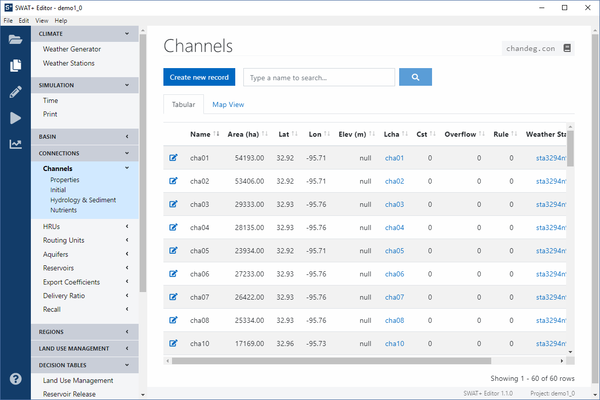
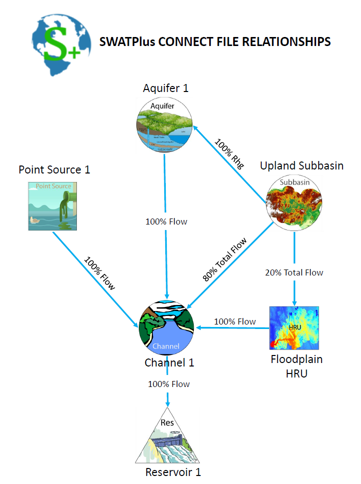

# Connections

The connections section contains all spatial object connectivity for the simulation run. In SWAT+ Editor, all connection object properties can be set through this section. For example, when you click on channels, you will see additional menu links appear for: properties, initialization, hydrology and sediment, and nutrients.

All connection objects have a similar format as seen in the above figure. The tabular view is shown by default. Click the map view tab to see a map with markers for the center coordinates of each object. Click an object marker in the map view, or edit icon on the left side of a row in the table to view or edit the object.

Each connection object will have a main properties object associated with it as well as a weather station. Click on these names in the table, or from the edit view page, click the button next to their names to view information about the properties object or weather station.

Each connection object may have outflow. This can be viewed in the table by clicking the eye icon in the rightmost column, or view from the edit page.

If you imported your project from GIS, your connection objects are populated automatically during project setup.

## Explanation of SWAT+ Spatial Objects

### Subbasin

The subbasin is defined by the DEM in the GIS interface as it always has been. All flow within the subbasin drains to the subbasin outlet.

### Landscape Unit

A landscape unit \(LSU\) is defined as a collection of HRUs and can be defined as a subbasin, or it could be a flood plain or upland unit, or it could be a grid cell with multiple HRUs. The landscape unit is not routed, it only used for output. The landscape unit output files \(waterbal, nutbal, losses, and plant weather\) are output for HRUs, landscape units, and for the basin. Two input files are required: 1\) landscape elements and, 2\) landscape define. The elements file includes HRUs and their corresponding LSU fraction and basin fractions. The define file specifies which HRUs are contained in each LSU.

### Routing Unit

A routing unit is a collection of hydrographs that can be routed to any spatial object.  The routing unit can be configured as a subbasin, then total flow \(surface, lateral and tile flow\) from the routing unit can be sent to a channel and all recharge from the routing unit sent to an aquifer.  This is analogous to the current approach in SWAT.  However, SWAT+ gives us much more flexibility in configuring a routing unit.  For example, in CEAP, we are routing each HRU \(field\) through a small channel \(gully or grass waterway\) before it reaches the main channel.  In this case, the routing unit is a collection of flow from the small channels.  We also envision simulating multiple representative hillslopes to define a routing unit.  Also, we are setting up scenarios that define a routing unit using tile flow from multiple fields and sending that flow to a wetland.

The routing unit is the spatial unit SWAT+ that allows us to lump outputs and route the outputs to any other spatial object.  It gives us considerably more flexibility than the old subbasin lumping approach in SWAT, and will continue to be a convenient way of spatial lumping until we can simulate individual fields or cells in each basin.

