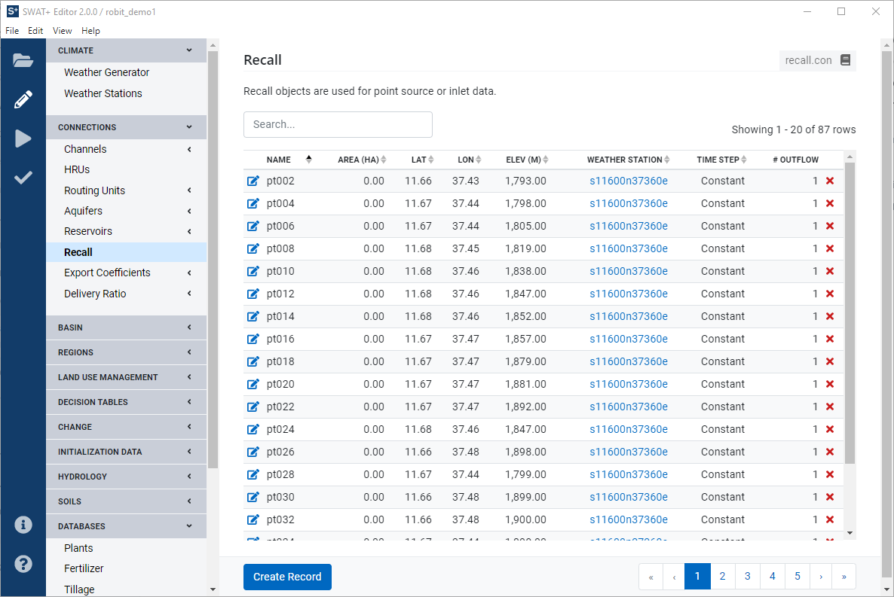
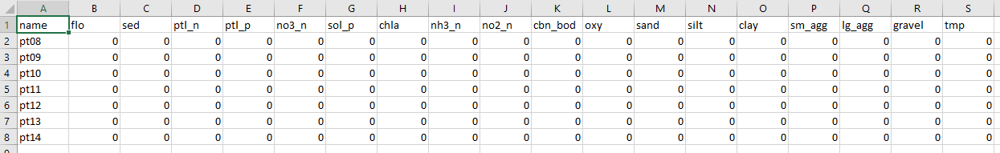

# Recall \(Point Source/Inlet\)

Recall objects are used for connecting point source or inlet data to your watershed. If you added point source in QSWAT+, when you import your project into SWAT+ Editor it will be connected via the recall section.

By default, constant data with all zero values during the default simulation period is added. To add your own recall data, click the recall item in the edit menu under connections. 

## Constant Data

By default, your recall data is imported as constant. To insert your values, you can edit each item individually by clicking the edit button and manually entering each value. Alternatively, you may upload a CSV of your data.

From the recall section, click the import/export button from the action bar at the bottom. Import is selected by default, so click the export button toggle. Choose a folder name, and click the export data button to get a template for your data.

Constant data will be located in the `recall.csv` file in the directory you selected. Edit the CSV as needed, save, and then go back to the editor and click the import/output button again. This time toggle the import button. Choose your directory containing your modified files and click the import CSV data button. Your updated values will appear in the table.

## Time Series Data

By default recall data is imported as constant, however this can be changed by clicking the edit button next to a row in the recall data table. Select the new time step for your data: daily, monthly, or yearly. Click the save changes button. Next, press the back button to go back to the table view. Click the import/export button. Import is selected by default, so click the export button toggle. Choose a folder name, and click the export data button to get a template for your data.

Your directory may now contain two files: a recall.csv containing constant data, and another csv file named for the recall object \(e.g., `pt002`\) you changed to time series.

Open the time series file after it is exported to see the template for your data. Modify your data as needed matching the time step you selected previously. Be sure the years match your simulation run time. In a yearly time step, `t_step` equals 1 through number of years. For monthly data, `t_step` equals the number of the month, and for daily it is the number of the day of the year.

You change other recall objects from constant to time series, and you can mix and match all different types \(constant, yearly, monthly, and daily\). For any recall objects moving from constant to time series, first delete its row in `recall.csv`. Then create a new csv with the file name matching the recall object's name and insert your time series data. Similarly, if you want to move from time series back to constant, just delete the time series file and add a row back into `recall.csv` for the object.

To import your data, click the import/export data button again and this time click to toggle import. Choose your directory and click import data. Your new data will appear in the table.

## Recall Table Definitions

| SWAT+ Input File | Database Table |
| :--- | :--- |
| recall.rec | recall\_rec |

| Field | Type | Description |
| :--- | :--- | :--- |
| id | int | Auto-assigned identifier |
| name | text | Name of recall object |
| rec\_typ | int | Time step for recall object \(1-daily, 2-monthly, 3-yearly\) |

Each record in recall\_rec will have a data file named {name}.rec. All of this data is stored in a single recall\_dat table in the database.

| SWAT+ Input File | Database Table |
| :--- | :--- |
| {name}.rec | recall\_dat |

| Field | Type | Description | Units |
| :--- | :--- | :--- | :--- |
| yr | int | Year |  |
| t\_step | int | Timestep |  |
| flo | real | Volume of water | m^3 |
| sed | real | Sediment | metric ton |
| ptl\_n | real | Organic nitrogen | kg N |
| ptl\_p | real | Organic phosphorus | kg P |
| no3\_n | real | Nitrate | kg N |
| sol\_p | real | Mineral \(soluble P\) | kg P |
| chla | real | Chlorophyll-a | kg |
| nh3\_n | real | Ammonia | kg N |
| no2\_n | real | Nitrogen dioxide | kg N |
| cbn\_bod | real | Carbonaceous biological oxygen demand | kg |
| oxy | real | Dissolved oxygen | kg |
| sand | real | Detached sand |  |
| silt | real | Detached silt |  |
| clay | real | Detached clay |  |
| sm\_agg | real | Detached small ag |  |
| lg\_agg | real | Detached large ag |  |
| gravel | real | Gravel |  |
| tmp | real | Temperature | deg c |

