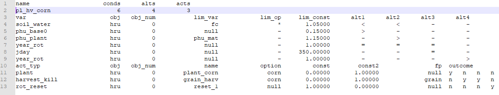

# Decision Tables

Decision tables are a precise yet compact way to model complex rule sets and their corresponding actions. Decision tables, like flowcharts and if-then-else and switch-case statements, associate conditions with actions to perform, but in many cases do so in a more elegant way \(see [Wikipedia article](https://en.wikipedia.org/wiki/Decision_table) on decision tables\).

Structure of decision tables:

1. Conditions
2. Condition alternatives
3. Actions
4. Action entries

Each decision corresponds to a variable, relation or predicate whose possible values are listed among the condition alternatives. Each action is a procedure or operation to perform, and the entries specify whether \(or in what order\) the action is to be performed for the set of condition alternatives the entry corresponds to. Many decision tables include in their condition alternatives the "don’t care" symbol, a hyphen. Using "don’t cares" can simplify decision tables, especially when a given condition has little influence on the actions to be performed. In some cases, entire conditions thought to be important initially are found to be irrelevant when none of the conditions influence which actions are performed.

## Usage in SWAT+

There are four decision table sections in SWAT+: land use management, reservoir release, scenario land use, and flow conditions.

See the land use management documentation, under management schedules for how to choose a decision table for your HRUs.



Reservoir release decision tables are assigned from the reservoir properties section under connections in SWAT+ Editor.

## Modifying Decision Tables in SWAT+ Editor

In the current version of SWAT+ editor, we do not have a GUI available for editing decision tables, however we have provided the ability to export the decision table file. You may then make changes to it in a text editor, and upload back into SWAT+ Editor.

## Table Definitions

| SWAT+ Input File | Database Table |
| :--- | :--- |
| lum.dtl, res\_rel.dtl, scen\_lu.dtl, flo\_con.dtl | d\_table\_dtl |
|  | d\_table\_dtl\_cond |
|  | d\_table\_dtl\_cond\_alt |
|  | d\_table\_dtl\_act |
|  | d\_table\_dtl\_act\_out |

### d\_table\_dtl

| Field | Type | Description |
| :--- | :--- | :--- |
| id | int | Auto-assigned identifier |
| name | text | Name of the decision table |
| file\_name | text | File name denoting type of decision table:  lum.dtl, res\_rel.dtl, scen\_lu.dtl, flo\_con.dtl |

### d\_table\_dtl\_cond

| Field | Type | Description | Related Table |
| :--- | :--- | :--- | :--- |
| id | int | Auto-assigned identifier |  |
| d\_table\_id | int | ID of decision table | d\_table\_dtl |
| var | text | Condition variable |  |
| obj | text | Object variable \(res, hru, etc\) |  |
| obj\_num | int | Object number |  |
| lim\_var | text | Limit variable \(evol, pvol, fc, etc\) |  |
| lim\_op | text | Limit operator \(\*, +, -\) |  |
| lim\_const | real | Limit constant |  |

### d\_table\_dtl\_cond\_alt

| Field | Type | Description | Related Table |
| :--- | :--- | :--- | :--- |
| id | int | Auto-assigned identifier |  |
| cond\_id | int | ID of condition | d\_table\_dtl\_cond |
| alt | text | Condition alternatives \(&gt;, &lt;, =\) |  |

### d\_table\_dtl\_act

| Field | Type | Description | Related Table |
| :--- | :--- | :--- | :--- |
| id | int | Auto-assigned identifier |  |
| d\_table\_id | int | ID of decision table | d\_table\_dtl |
| act\_typ | text | Type of action \(reservoir, irrigate, etc\) |  |
| obj | text | Object variable \(res, hru, etc\) |  |
| obj\_num | int | Object number |  |
| name | text | Name of action |  |
| option | text | Action option-specific to type of action \(e.g., for reservoir, option to input rate, days of draw-down, weir equation pointer, etc\) |  |
| const | real | Constant used for rate, days, etc |  |
| const2 | real |  |  |
| fp | text | Pointer for option \(e.g., weir equation pointer\) |  |

### d\_table\_dtl\_act\_out

| Field | Type | Description | Related Table |
| :--- | :--- | :--- | :--- |
| id | int | Auto-assigned identifier |  |
| act\_id | int | ID of action | d\_table\_dtl\_act |
| outcome | bool | Perform action \(1 or true\), or don't perform action \(0 or false\) |  |

## Text File Example and Explanation

The following is an example of a decision table in the lum.dtl input file. It is a table for warm season annual crops, using continuous corn.

In the above table, there are 6 conditions, 4 alternatives and 3 actions.

### Description of the conditions

1. soil\_water – if soil water is too high \(&gt; 1.50\*field capacity\), it will be too wet to operate machinery
2. plant\_gro – \(“n”\) Planting allowed if plant is not growing.
3. phu\_base0 – \(0.15\) when the sum base zero heat units for the year \(starting Jan 1\) exceeds 0.15, indicating it’s warm enough to plant
4. phu\_plant – \(1.15\) harvest is scheduled when the sum of the heat units for the crop exceed 1.15 \(if the heat units to maturity for the crop = 1500, then harvest would be scheduled at 1.15 \* 1500 = 1725\). 
5. year\_rot – needed to identify the current year of rotation.  In this example, corn is grown in year 1.
6. days\_plant – days since last plant \(200\) to ensure harvest occurs before next crop is planted.

### Description of the alternatives

If all of the conditions for each alternative are met, outcomes are checked for ‘y’ to take action. Alternatives with dash \(‘-‘\) are not checked.

1. plant corn based on heat units: if soil water &lt; 1.50\*fc and  if phubase0 &gt; 0.15\*phu\_mat and if year\_rot = 1  then check outcomes for ‘y’ and if ‘y’, take that action \(plant\)
2. Harvest corn based on crop accumulated heat units: if soil\_water &lt; 1.50\*fc and if phu\_plant &gt; 1.15\*phu\_mat and if year\_rot = 1 and then check outcomes for ‘y’ and if ‘y’, take that action \(plant\)
3. Harvest corn based on days since planting: if year\_rot = 1 and if days\_plant =200 then check outcomes for ‘y’ and if ‘y’, take that action \(harvest\)
4. Reset rotation year: if year\_rot &gt; 1 then check outcomes for ‘y’ and if ‘y’, take that action \(rot\_reset\)

### Description of the actions

1. plant: corn – cross walked to plant name in plants.plt file
2. harvest\_kill:  corn – cross walked to plant name in plants.plt file grain – relates to harvest type in harv.ops file 
3. rot\_reset: rotation reset – for continuous corn \(1 year rotation\). The rotation year is reset to 1 at the end of every year.

