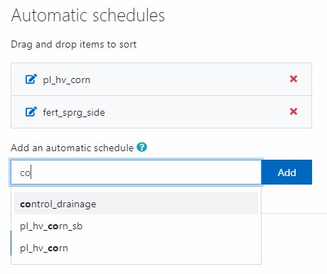
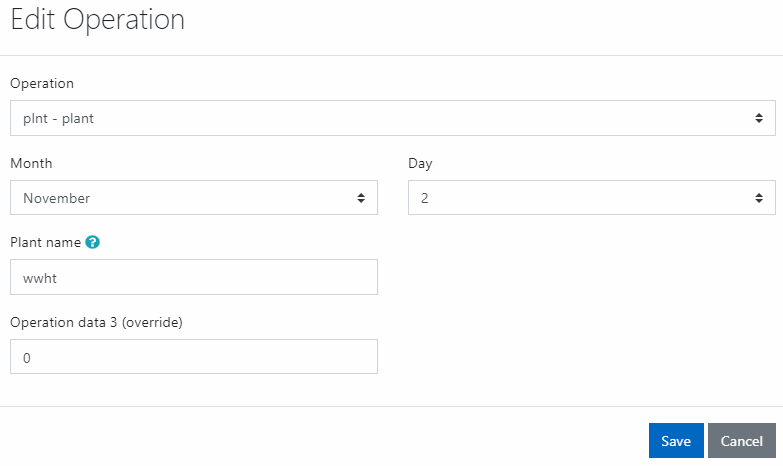

# Land Use Management

A primary goal of environmental modeling is to assess the impact of human activities on a given system. Central to this assessment is the itemization of the land and water management practices taking place within the system. This section contains input data for planting, harvest, irrigation applications, nutrient applications, pesticide applications, and tillage operations. Information regarding tile drains and urban areas is also stored in this file.

| SWAT+ Input File | Database Table |
| :--- | :--- |
| landuse.lum | landuse\_lum |
| management.sch | management\_sch |
|  | management\_sch\_auto |
|  | management\_sch\_op |
| cntable.lum | cntable\_lum |
| ovn\_table.lum | ovn\_table\_lum |
| cons\_practice.lum | cons\_practice\_lum |

In addition to the above, SWAT+ Editor groups the operations databases in this section of the editor. However, within the SWAT+ master watershed file \(file.cio\), these are listed under the ops section.

| SWAT+ Input File | Database Table |
| :--- | :--- |
| graze.ops | graze\_ops |
| harv.ops | harv\_ops |
| irr.ops | irr\_ops |
| sweep.ops | sweep\_ops |
| fire.ops | fire\_ops |
| chem\_app.ops | chem\_app\_ops |

## Land Use Management

This section is the entry point for management data in SWAT+. It comprises cross-walks to several other sections of data.

This data is accessed from the HRU properties section \(hru-data.hru\).

### landuse\_lum

| Field | Type | Description | Related Table |
| :--- | :--- | :--- | :--- |
| id | int | Auto-assigned identifier |  |
| name | text | Name of the land use properties |  |
| cal\_group | text | Calibration group |  |
| plnt\_com\_id | int | Plant community | plant\_ini |
| mgt\_id | int | Management schedule | management\_sch |
| cn2\_id | int | Curve number | cntable\_lum |
| cons\_prac\_id | int | Conservation practices | cons\_prac\_lum |
| urban\_id | int | Urban land use | urban\_urb |
| urb\_ro | text | Urban runoff |  |
| ov\_mann\_id | int | Overland flow Manning's n | ovn\_table\_lum |
| tile\_id | int | Tile drain | tiledrain\_str |
| sep\_id | int | Septic tank | septic\_str |
| vfs\_id | int | Filter strip | filterstrip\_str |
| grww\_id | int | Grassed waterway | grassedww\_str |
| bmp\_id | int | Best management practices | bmpuser\_str |
| description | text | Optional description of the row |  |

## Management Schedules

Management schedules comprise auto-schedules \(decision tables\) and/or operations schedules.

When you import your project from GIS, SWAT+ assigns auto-schedules for management based on your crop land use.

| Plant Type \(in plants\_plt\) | Decision Table Template |
| :--- | :--- |
| warm\_annual | pl\_hv\_corn |
| cold\_annual | pl\_hv\_wwht |
| perennial | no management schedule |

For example, oats is a cold annual crop. If this crop is in your HRUs, a decision table named pl\_hv\_oats will be created based on the template of pl\_hv\_wwht when you import your data from GIS.

### Adding/Editing a Schedule

From the management schedules section, click create a new record or click edit on a row in the table. Give your schedule a unique name.

To add an automatic schedule, start typing a decision table name in the box provided. Click the desired result from the list of matches that pops up, and click the add button. If you enter more than one schedule, you can drag and drop to sort.

To add an operation, click the add operation button. Select your operation type from the form that pops up and complete the remaining fields. Click save when done to add the operation to your table.

When you're done adding automatic schedules and operations, **click the save changes button** to save your management schedule.

### Table Parameters

#### management\_sch

| Field | Type | Description |
| :--- | :--- | :--- |
| id | int | Auto-assigned identifier |
| name | text | Name of the schedule |

#### management\_sch\_auto

| Field | Type | Description |
| :--- | :--- | :--- |
| id | int | Auto-assigned identifier |
| management\_sch\_id | int | ID of management schedule |
| d\_table\_id | int | ID of decision table |

#### management\_sch\_op

| Field | Type | Description |
| :--- | :--- | :--- |
| id | int | Auto-assigned identifier |
| management\_sch\_id | int | ID of management schedule |
| op\_typ | text | Type of operation \(see options below\) |
| mon | int | Month operation takes place |
| day | int | Day operation takes place |
| op\_data1 | text | Dependent on op\_typ \(see options below\) |
| op\_data2 | text |  |
| op\_data3 | real | Override value |

#### Operations Types

| Code | Description |
| :--- | :--- |
| plnt | plant |
| harv | harvest only |
| kill | kill |
| hvkl | harvest and kill |
| till | tillage |
| irrm | irrigation |
| fert | fertilizer |
| pest | pesticide application |
| graz | grazing |
| burn | burn |
| swep | street sweep |
| prtp | print plant vars |
| skip | skip to end of the year |

#### Operation Data 1 Values

| Code | Value | Look-up Table |
| :--- | :--- | :--- |
| plnt | plant name | plants\_plt |
| harv | plant name | plants\_plt |
| kill | plant name | plants\_plt |
| hvkl | plant name | plants\_plt |
| till | tillage name | tillage\_til |
| irrm | irrigation operation name | irr\_ops |
| fert | fertilizer name | fertilizer\_frt |
| pest | pesticide name | pesticide\_pst |
| graz | graze operation name | graze\_ops |
| burn | fire operation name | fire\_ops |
| swep | street sweep operation name | sweep\_ops |
| prtp | none |  |
| skip | none |  |

#### Operation Data 2 Values

| Code | Value | Look-up Table |
| :--- | :--- | :--- |
| plnt | none |  |
| harv | harvest operation name | harv\_ops |
| kill | none |  |
| hvkl | harvest operation name | harv\_ops |
| till | none |  |
| irrm | none |  |
| fert | chemical application operation name | chem\_app\_ops |
| pest | chemical application operation name | chem\_app\_ops |
| graz | none |  |
| burn | none |  |
| swep | none |  |
| prtp | none |  |
| skip | none |  |

## Operations Databases

Values in the operations tables are provided in the SWAT+ datasets database and copied to your project database during project setup. You may modify them or add new rows as needed in the editor.

### Harvest

| SWAT+ Input File | Database Table |
| :--- | :--- |
| harv.ops | harv\_ops |

| Field | Type | Description | Units |
| :--- | :--- | :--- | :--- |
| id | int | Auto-assigned identifier |  |
| name | text | Name of operation |  |
| harv\_typ | text | Harvest type: grain, biomass, residue, tree, or tuber |  |
| harv\_idx | real | Harvest index target specified at harvest |  |
| harv\_eff | real | Harvest efficiency |  |
| harv\_bm\_min | real | Minimum biomass to allow harvest | kg/ha |
| description | text | Optional description |  |

### Graze

| SWAT+ Input File | Database Table |
| :--- | :--- |
| graze.ops | graze\_ops |

| Field | Type | Description | Units | Range |
| :--- | :--- | :--- | :--- | :--- |
| id | int | Auto-assigned identifier |  |  |
| name | text | Name of operation |  |  |
| fert\_id | int | ID of fertilizer from fertilizer\_frt |  |  |
| bm\_eat | real | Dry weight of biomass removed by grazing daily | kg/ha | 0-500 |
| bm\_tramp | real | Dry weight of biomass removed by trampling daily | kg/ha | 0-500 |
| man\_amt | real | Dry weight of manure deposited | kg/ha | 0-500 |
| grz\_bm\_min | real | Minimum plant biomass for grazing to occur | kg/ha | 0-5000 |
| description | text | Optional description |  |  |

### Irrigation

| SWAT+ Input File | Database Table |
| :--- | :--- |
| irr.ops | irr\_ops |

| Field | Type | Description | Units | Range |
| :--- | :--- | :--- | :--- | :--- |
| id | int | Auto-assigned identifier |  |  |
| name | text | Name of operation |  |  |
| irr\_eff | real | Irrigation efficiency |  | 0-1 |
| surq\_rto | real | Surface runoff ratio |  | 0-1 |
| irr\_amt | real | Depth of application for subsurface | mm | 0-100 |
| irr\_salt | real | Concentration of salt in irrigation water | mg/l |  |
| irr\_no3n | real | Concentration of nitrate in irrigation water | mg/l |  |
| irr\_po4n | real | Concentration of phosphate in irrigation water | mg/l |  |
| description | text | Optional description |  |  |

### Chemical Application

| SWAT+ Input File | Database Table |
| :--- | :--- |
| chem\_app.ops | chem\_app\_ops |

| Field | Type | Description | Units |
| :--- | :--- | :--- | :--- |
| id | int | Auto-assigned identifier |  |
| name | text | Name of operation |  |
| chem\_form | text | Chemical form: liquid or solid |  |
| app\_typ | text | Application type: spread, spray, inject, direct |  |
| app\_eff | real | Application efficiency |  |
| foliar\_eff | real | Foliar efficiency |  |
| inject\_dp | real | Injection depth | mm |
| surf\_frac | real | Surface fraction amount in upper 10mm |  |
| drift\_pot | real | Drift potential |  |
| aerial\_unif | real | Aerial uniformity |  |
| description | text | Optional description |  |

### Fire

| SWAT+ Input File | Database Table |
| :--- | :--- |
| fire.ops | fire\_ops |

| Field | Type | Description |
| :--- | :--- | :--- |
| id | int | Auto-assigned identifier |
| name | text | Name of operation |
| chg\_cn2 | real | Change in SCS curve number II value |
| frac\_burn | real | Fraction burned |
| description | text | Optional description |

### Sweep

| SWAT+ Input File | Database Table |
| :--- | :--- |
| sweep.ops | sweep\_ops |

| Field | Type | Description |
| :--- | :--- | :--- |
| id | int | Auto-assigned identifier |
| name | text | Name of operation |
| swp\_eff | real | Removal efficiency of sweeping operation |
| frac\_curb | real | Fraction of the curb length that is sweep-able |
| description | text | Optional description |

## Curve Number Table

Values in this table are provided in the SWAT+ datasets database and copied to your project database during project setup. You may modify them or add new rows as needed in the editor.

| SWAT+ Input File | Database Table |
| :--- | :--- |
| cntable.lum | cntable\_lum |

| Field | Type | Description | Range |
| :--- | :--- | :--- | :--- |
| id | int | Auto-assigned identifier |  |
| name | text | Name of curve number entry |  |
| cn\_a | real | Curve number for hydrologic soil group A | 30-100 |
| cn\_b | real | Curve number for hydrologic soil group B | 30-100 |
| cn\_c | real | Curve number for hydrologic soil group C | 30-100 |
| cn\_d | real | Curve number for hydrologic soil group D | 30-100 |
| description | text | Optional description |  |
| treat | text | Treatment/Practice |  |
| cond\_cov | text | Condition of cover |  |

## Conservation Practices

Values in this table are provided in the SWAT+ datasets database and copied to your project database during project setup. You may modify them or add new rows as needed in the editor.

| SWAT+ Input File | Database Table |
| :--- | :--- |
| cons\_practice.lum | cons\_practice\_lum |

| Field | Type | Description |
| :--- | :--- | :--- |
| id | int | Auto-assigned identifier |
| name | text | Name of curve number entry |
| usle\_p | real | Usle p factor |
| slp\_len\_max | real | Maximum slope length |
| description | text | Optional description |

## Overland Flow Manning's n

Values in this table are provided in the SWAT+ datasets database and copied to your project database during project setup. You may modify them or add new rows as needed in the editor.

| SWAT+ Input File | Database Table |
| :--- | :--- |
| ovn\_table.lum | ovn\_table\_lum |

| Field | Type | Description |
| :--- | :--- | :--- |
| id | int | Auto-assigned identifier |
| name | text | Name of curve number entry |
| ovn\_mean | real | Overland flow Manning's n = mean |
| ovn\_min | real | Overland flow Manning's n = min |
| ovn\_max | real | Overland flow Manning's n = max |
| description | text | Optional description |

