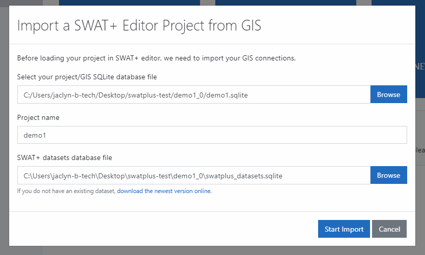
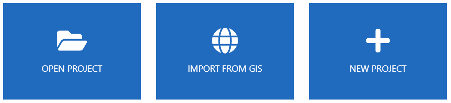

# Project Setup

When you open SWAT+ Editor, you are taken to the project setup screen. If you are coming from QSWAT+, an overlay will appear with the paths to your project databases. You may edit these as needed, and click the start import button.

When your project is done importing from GIS, it will be selected as your current project and displayed in the recent projects sidebar on the left as well as in the center screen.

From here you can start editing your SWAT+ inputs by clicking the button in the middle, or by clicking the paper icon in the far left blue-colored menu.

## SWAT+ lte

SWAT+ lte is a version of the SWAT+ model that greatly simplifies hydrology and plant growth and does not simulate nutrients, concentrating on gully formation and stream degradation. It only uses channel and HRU objects, so this option is not available if you have point source or reservoirs.

If your project in QSWAT+ does not have point source or reservoirs, you will have an option to set up your project for SWAT+ lte by checking the box. Otherwise, this option is hidden.

## Other options for opening a project

If you are not coming from QSWAT+, you may open the editor and choose from one of three options:

Open project allows you to select an existing SWAT+ Editor project settings file and load it into the editor. Please note that this is an existing **editor** project, not any SWAT+ project. You must have an existing .json file for this option to work.

Click import from GIS to manually select your QSWAT+ project database file. From here the steps are the same as described above when coming directly from QSWAT+.

Click new project to start a SWAT+ project from scratch, or if you have an existing SWAT+ project database but no settings file. If creating from scratch, leave the project database field blank and it will be created for you.

