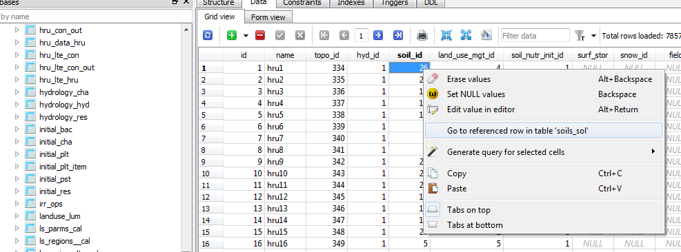
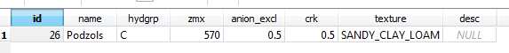

# How to Use SQLite

QSWAT+ and SWAT+ Editor use a [SQLite](https://www.sqlite.org/) database to hold model input data to allow easy manipulation by the user. The database is structured to closely resemble the SWAT+ input text files in order to keep a clean link between the model and editor.

## Opening the SQLite Database

We recommend using the SWAT+ Editor program provided to browse and edit SWAT+ input data. However, if you need to access the database, we recommend using:

* [SQLite Studio](https://sqlitestudio.pl/)

There are many other alternatives out there. A few of them are:

* [DB Browser for SQLite](http://sqlitebrowser.org/)
* [SQLite Manager, Firefox Add-On](https://addons.mozilla.org/en-US/firefox/addon/sqlite-manager-webext/)

## Understanding Table Relationships

SWAT+ contains many cross-walks between files, and the database follows suit by creating foreign key relationships where applicable. In the SWAT+ text files, you will see files reference object names from another file. In the database however, these are done with an integer id. Relational databases make it easy to view the referenced row.

In SQLite Studio, right-click a foreign key id in a row of data, and select “Go to referenced row in table …” as shown in the image below. This will open the referenced row of data in a new tab.

Results in:

